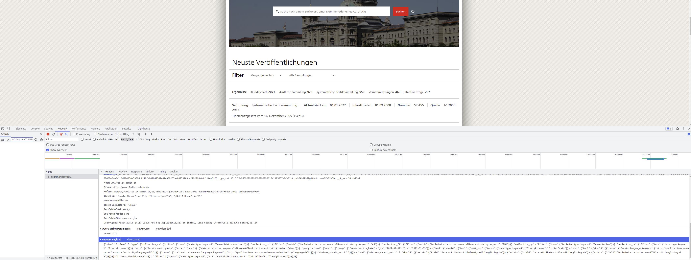

# Fedlex Scrapers

###### About the project

A scraper on [https://www.fedlex.admin.ch](https://entscheidsuche.ch/docs/).

Fedlex website have an api endpoint which is `https://www.fedlex.admin.ch/elasticsearch/proxy/_search?index=data`

For now we are only interested on:

1. Bundesblatt
2. Classified Compilations
3. Consultation Procedure
4. Official Compilations
5. Treaties

To target certain interests we only need to get the proper payload to get our desired data.

###### How to get payload.

1. Go to [https://www.fedlex.admin.ch/en/home]()
2. On Recent Publications you can use filter to get the desired data
3. Before changing filters, open developer tools and under Network tab you will see `__search?undex=data request` if you click on it you will open more information about that request and Headers tab you will need to scroll down to see the Payload row. It should like in the picture below.

