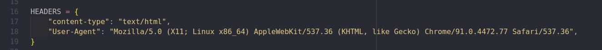

# Largest Law Firm Scrapers

###### About the project

A scraping project get lawyers information on largest law firms.

###### Starting URLS

- [https://homburger.ch/en/team]()
- [https://www.kellerhals-carrard.ch/en/people/index.php]()
-

###### Problems encountered when building the scraper:

###### Problems when running the scraper:

## SCRAPERS

###### Prerequisites

`python3` installed in your system

###### Installation

1. Clone the repo (if you don't have yet in your computer)
   ```
   git clone https://github.com/deepjudge-ai/scrapers.git
   ```
2. Install the dependencies
   ```
   pip install -r requirements.txt
   ```
3. Run .py file

### Homburger Scraper

Starting url - [https://homburger.ch/en/team]()

```
The important note is to keep in check on certain combination of characters to access profile_page_api ex: gZN3UKFUOQtdEV_C9Z7tM
```


### Kellerhals Carrard Scraper

Starting url - [https://www.kellerhals-carrard.ch/en/people/index.php]()

**Problems**

```
Starting url returns 406 error.
```

```
Fix problem by adding manual header
```



To solve issue on scraping different languages, I created a list of predefined items that contains the required link and xpaths on different languages (EN, DE, FR, IT):


### Walderwyss Scraper

Starting url - [https://www.walderwyss.com/en/lawyers]()

To solve issue on scraping different languages, I created a list of predefined items that contains the required link and xpaths on different languages (EN, DE, FR, IT):


### Wengervieli Scraper

Starting url - [https://wengervieli.ch/en-us/team]()

**Problems**

Encountered problems are too many publications files needed to download.

Images are usually on .aspx solved the issue by using replace method


